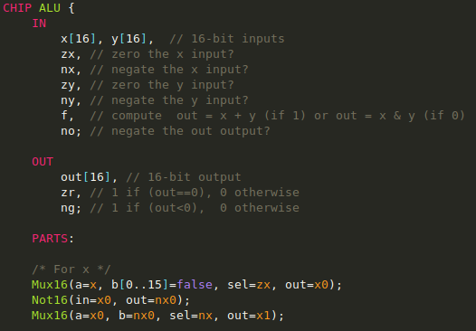
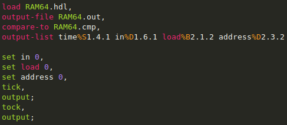
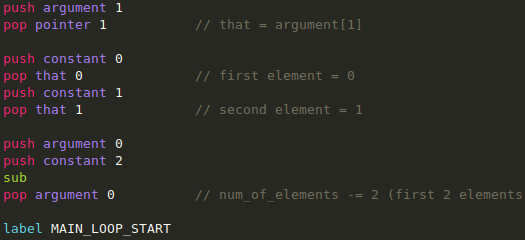
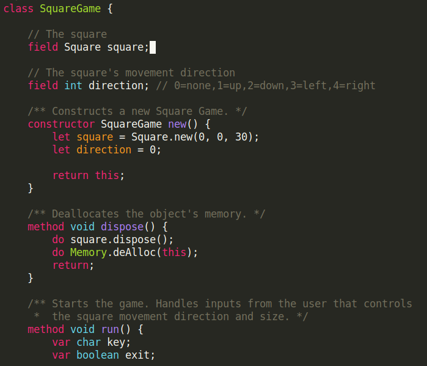

### init-nand2tetris.el

An Emacs init file which provides major modes for those special programming languages required in the projects comes with this book *The Elements of Computing Systems*. The authors have also launched an online course called `nand2tetris` based on this book.

Those languages are designed for the Hack platform introduced in the book. They have deliberately simple structures and serve as tools to reveal the software engineering principles underlying modern computing systems.

#### Languages

* .hdl  - Hardware description language
* .tst  - Test script for simulators in the software suite
* .vm   - The intermediate representation used by the VM translator
* .jack - The high level language [TODO]

There are other packages or projects which will do the same job and provide more cool features. And I found them hard to integrate in my emacs configuration `.emacs.d` and they only support `.hdl` files. If you just want a simple solution, I believe this is the one you are looking for.

#### Screenshot
1. HDL  

2. Test script  

3. VM language  

4. VM language  

#### Usage

1. Put this file in your `.emacs.d` folder.
2. Add `(require 'init-nand2tetris)` in your `init.el` file

*Or add the main content of this file to your `.emacs` file.*

And this file does **NOT** require any kind of dependent package.

#### Links
You can find the online version of this book at the link below:
[http://www1.idc.ac.il/tecs/plan.html](http://www1.idc.ac.il/tecs/plan.html)

And online course called `nand2tetris` based on this book:
[https://www.coursera.org/learn/build-a-computer](https://www.coursera.org/learn/build-a-computer)

#### Notes
There is a requirement in the HDL grammer that the underscores and the characters following them will be ignored in the naming of internal pins
